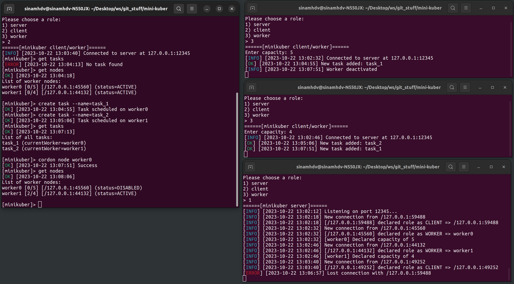

# mini-kuber
A simulated distributed task-scheduling system written in Java.

## Features
- Adding/deleting tasks
- Disabling/enabling worker nodes temporarily
- Load balancing between workers
- Distributing tasks to other workers when one worker loses connection
- Simultaneous control from multiple clients

## Explanation
Each instance has a role: server, client, or worker. The server is the master node which connects all other nodes and handles communication between them. Before launching any other node, only one instance of the server must be launched. Workers are the nodes that receive the tasks and clients are interfacs to control and monitor tasks and workers.

## Client Commands
- `create task --name=<task_name> [--node=<worker_name>]` to create a new task (use `--node` to manually suggest a worker node, otherwise it will be automatically selected)
- `delete task --name=<task_name>` to delete a task
- `get tasks` to get a list of all tasks and their status
- `get nodes` to get a list of all nodes and their status
- `cordon node <worker_name>` to disable a worker node temporarily
- `uncordon node <worker_name>` to re-enable a worker node
